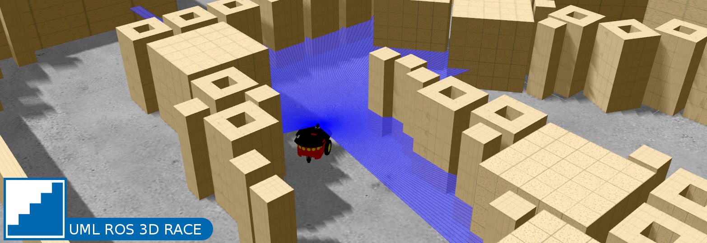

  
# ROS 3D RACE  

## Setup:
1. Clone this repository into your catkin workspace.
  > cd ~/<your_ws>/src   
  > git clone https://github.com/pgavriel/uml_3d_race.git    
2. Build your catkin workspace.   
  > cd ..  
  > catkin build   
3. Source the workspace.  
  > source devel/setup.bash   
4. Run the setup script for uml_3d_race. (While still in your workspace directory)
  > rosrun uml_3d_race setup.sh  

At this point, if all goes well, the package should be ready to run.  

**NOTE BEFORE STARTING:** Sometimes Gazebo can be a bit finicky, and may fail to launch properly for an array of reasons. If something goes wrong, Ctrl+c and try again a few times. If the problem persists there may be an actual issue that needs to be resolved first, but unless you've already started making changes within this package, that shouldn't be the case.  

## Getting Started:   
1. In a terminal, launch Gazebo (This launch file includes gazebo, gazebo world to load, robot model, and more):  
  > roslaunch uml_3d_race level1.launch  
2. In a second terminal, launch the referee which records your time and the mover_node which controls the robots movement:  
  > roslaunch uml_3d_race race.launch  

#### Resetting the robot   
When things inevitably go wrong, shutdown the terminal running race.launch with 'Ctrl+c', and reset the robots position via:  
  > roslaunch uml_3d_race reset_robot.launch  

#### Making Changes  
You may notice that the robot is able to make it to the end of the first level with the code provided, but it will struggle with anything more difficult.  
Open up src/mover.cpp and examine the code provided. This is where you will start making changes in an attempt to make the robots navigation more capable.  
When you make changes to source code within a ROS package **remember to rebuild the workspace (*catkin build*) or the changes will not be applied when you run your node again**.  
After making changes and rebuilding, see if things work as you intended by launching race.launch again.  

#### Making Progress  
When you feel like you have beaten the current level, shutdown the terminal running gazebo with 'Ctrl+c', and try the loading the next world via:  
  >roslaunch uml_3d_race levelX.launch  

## Challenge:  
Your goal is to use the sensor data being received by the robot to navigate through increasingly complex stages in the fastest time possible.
Start with level1.launch and work your way up. Write an algorithm that can find its way through any course!  

## File Structure:  
* **launch/** - Contains all necessary ROS .launch files.  
* **msg/** - Custom ROS message definition.  
* **resources/** - Package resources.  
  * **config/** - Contains a configuration for a range laser filter.  
  * **maps/** - Contains maps to be used by map_server for navigation.   
  * **models/** - Contains package models.  
    * **pioneer3dx/** - URDF/xacro definition of our pioneer robot.  
      * **config/** - Contains robot sensor configuration settings.  
    * **obstacles/** - Contains obstacle models for making new worlds.   
    * **track_models/** - Contains track models for making new worlds.  
    * **sdf_robots/** - Older SDF definitions of pioneer robots. Without xacro, they are much more difficult to configure.  
  * **textures/** - Contains custom Gazebo texture files.  
* **src/** - Contains all c++ source files.  
  * **mover.cpp** - Publishes movement commands to the robots cmd_vel topic based on sensor data.  
  * **referee.cpp** - Checks distance between the robot and it's goal, records the time it takes to reach the goal.  
  * **reset_robot.cpp** - Subscribes to the /spawn topic and sets the robot models position.  
  * **spawn_pub.cpp** - Publishes the robots spawn location on the /spawn topic.   
  * **goal_pub.cpp** - Publishes a goal on the /goal topic.  
* **worlds/** - Contains all .world files for Gazebo to load.  
* **setup.sh** - A setup script that makes the models and textures provided in this package available for Gazebo to use.  

## Important Launch Files:    
* **gazebo.launch** - Launches Gazebo as an empty world or loads a specific world file. This launch file does not include any robots. This file is included in other launch files to reduce their complexity, and it can be useful for creating or modifying world files.  
To launch an empty world:  
  > roslaunch uml_3d_race gazebo.launch load_world:=false  

  To specify a world:  
    > roslaunch uml_3d_race gazebo.launch world:=[world filename excluding .world extension]  

* **spawn_robot.launch** - Assuming Gazebo is already running, this launch file will load the robot_description from a .xacro file, spawn the model into Gazebo with the given model_name and position, create a node to publish the spawn position (for resetting to), and adds a laser filter to remove infinite values from the frontal laser.  
To spawn a robot with a specified name and/or position (example):  
  > roslaunch uml_3d_race spawn_robot.launch model_name:=pioneer x:=5.0 y:=5.0 yaw:=3.14  

* **spawn_world.launch** - This launch file includes both gazebo.launch and spawn_robot.launch in order to load a gazebo world, and spawn a robot within it in just one file. The world file and robot spawn positions are sent to their respective launch files as arguments. You will notice that each levelx.launch file simply includes this launch file and specifies the relevant arguments, making it easy to launch specific configurations. Changing the default values of the arguments in this file is perfectly acceptable, but you can specify them in a command as well.  
For example:  
  > roslaunch uml_3d_race spawn_world.launch world:=baby_steps spawn_x:=0.0 spawn_y:=0.0 spawn_yaw:=0.0  

* **race.launch** - This launch file simply starts a referee node and a mover node simultaneously. If a goal is specified on the /goal topic, the referee will track the distance of the robot to the goal. The referee starts a timer when the robot starts moving and stops it when you're within a certain proximity to the goal, letting you know how quickly you were able to reach it.  
  > roslaunch uml_3d_race race.launch  

## Things to Explore:  
- The launch file structure of this repository   
- How to create and use your own gazebo world course  
- How to add more sensors to the robot
- How to use multiple sensors simultaneously   
- How to use depth camera data  
- How to implement a navigation stack
- How to tune and configure a navigation stack      
- How to create/define your own models    
- How to use custom textures   

## Useful Resources:  
[ROS Tutorials](http://wiki.ros.org/ROS/Tutorials)  
[Gazebo Tutorials](http://gazebosim.org/tutorials)  
[ROS .launch file documentation](http://wiki.ros.org/roslaunch/XML)  
[ROS Navigation](http://wiki.ros.org/navigation)  
[Navigation Tuning Guide](https://wiki.ros.org/navigation/Tutorials/Navigation%20Tuning%20Guide)    
[Nav Tuning Guide Paper](http://kaiyuzheng.me/documents/navguide.pdf)   

[URDF Tutorials](http://wiki.ros.org/urdf/Tutorials)   
[URDF XML Specification](https://wiki.ros.org/urdf/XML)   
[SDF (Simulation Description Format) Specification for Gazebo Models](http://sdformat.org/spec)  
[OGRE Material Script Documentation (Gazebo Textures)](https://ogrecave.github.io/ogre/api/1.12/_material-_scripts.html)  

[Atom IDE (Not required, but I find it useful)](https://atom.io/)    
[Your best friend](http://google.com)  
